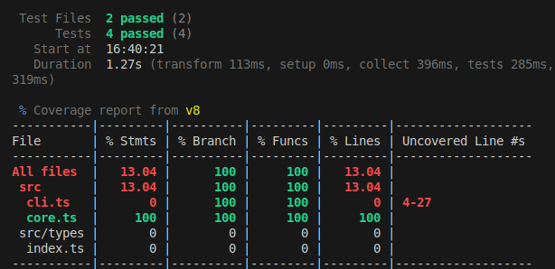

# TypeScript Template Project

## Overview
This project is a TypeScript template designed to streamline the development of applications with a core API and a command-line interface (CLI). It includes a structured setup for testing and ensures that all workflows are functional from the start.

## Objectives:
 - Set up a TypeScript project for AI Paired Programming that allows for the following prompts:

 ```
 Implement feature X.X and use 'run npm test' until all tests pass with 100% coverage.
 ```
 ```
 #Problems fix all TypeScript errors and use 'run npm test' until all tests pass with 100% coverage.
 ```

**Example Terminal Test Output:**



## Project Structure
```
typescript-template
├── src
│   ├── core
│   │   ├── core.ts         # Core logic of the application
│   │   └── core.test.ts    # Tests for core functionality
│   ├── cli
│   │   ├── cli.ts          # Implementation of the CLI
│   │   └── cli.test.ts     # Tests for CLI functionality
│   └── types
│       └── index.ts        # TypeScript interfaces and types
├── package.json            # npm configuration
├── tsconfig.json           # TypeScript configuration
├── vitest.config.ts        # Vitest configuration for testing
├── c8.config.js            # c8 configuration for coverage reporting
└── README.md               # Project documentation
```

## Setup Instructions
1. **Clone the repository:**
   ```
   git clone <repository-url>
   cd typescript-template
   ```

2. **Install dependencies:**
   ```
   npm install
   ```

3. **Build the project:**
   ```
   npm run build
   ```

## Usage
- To run the CLI, use:
  ```
  npx <package-name>
  ```

## Testing
- To run all tests with coverage, execute:
  ```
  npm run test
  ```

- To run an individual test file, use:
  ```
  npx vitest run <file> --coverage
  ```

## Contributing
Contributions are welcome! Please open an issue for any enhancements or bug fixes.

## License
This project is licensed under the MIT License. See the LICENSE file for details.